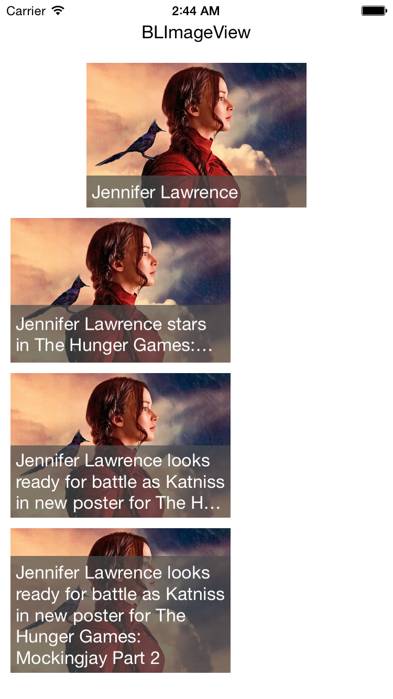

# BLImageView
An ImageView on which a dynamic/fixed height text can be displayed and it can take action also.

## Screenshots



## Usage

### Basic usage

Add BLImageView class into your project.

```objective-c
#import "ViewController.h"
#import "BLImageView.h"

@interface ViewController()

@property (weak, nonatomic) IBOutlet BLImageView *imageView;

@end
```

```objective-c
@implementation ViewController

- (void)viewDidLoad {
    [super viewDidLoad];
    
    // Set dynamicHeight to automatic growing text
    _imageView.dynamicHeight = YES;
    
    // Set textHeightLimit to restrict the text height growing
    _imageView.textHeightLimit = 0.4;
    
    // Set text
    _imageView.overLabel.text = @"Jennifer Lawrence stars in The Hunger Games: Mockingjay Part 2";
}

#pragma mark - Image Click Action
- (void)blImageViewClickAction:(id)sender {
    NSLog(@"Yay, Image is clicked!");
}
```

## Example Project
Check out Example project and try out things in detail.
 - You can customize overLabel and overView

## Requirements

- iOS 7 or higher
- Automatic Reference Counting (ARC)

## Author

- [Babulal Poonia](https://github.com/BLPoonia) ([@_iambabu](https://twitter.com/_iambabu))

## License

BLMultiColorLoader is released under the MIT license. See the LICENSE file for more info.
